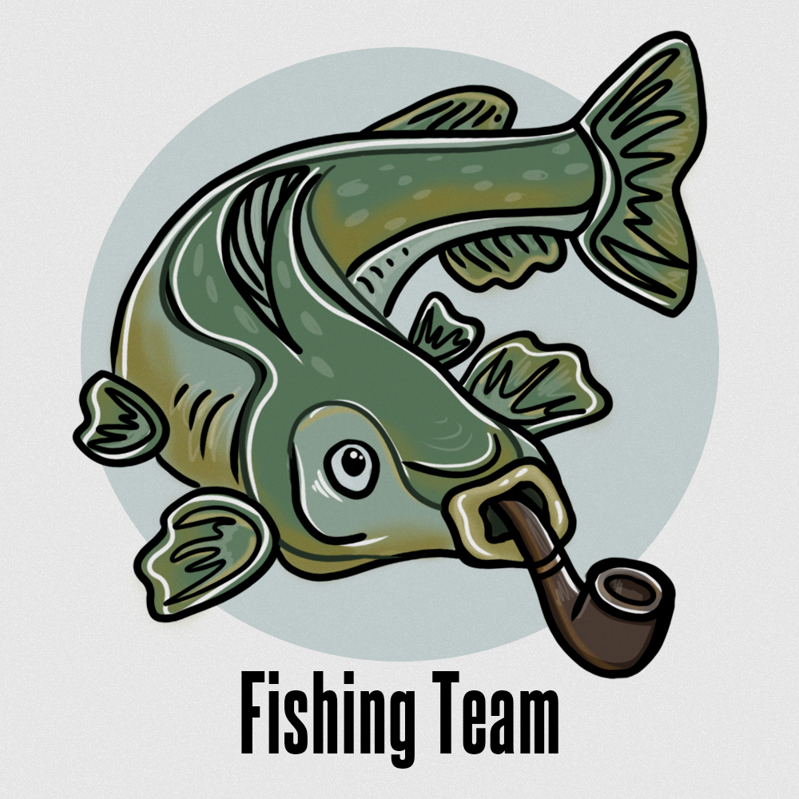

# Игра "Камень - Ножницы - Бумага"

Добро пожаловать в репозиторий проекта "Камень - Ножницы - Бумага"! Данный проект представляет собой игру, в которой пользователь соревнуется с компьютером, используя реальные жесты, определяемые с помощью нейронной сети.

---

## Описание проекта

**Кейс:** Разработка игры "Камень - Ножницы - Бумага", в которой:
- Пользователь играет против компьютера.
- Программа получает изображение с камеры, распознаёт один из трех жестов:
  - **Камень**
  - **Ножницы**
  - **Бумага**
- Компьютер генерирует случайный выбор из этих же вариантов.
- На основе общепринятых правил:
  - Ножницы побеждают бумагу.
  - Бумага побеждает камень.
  - Камень побеждает ножницы.
- Результат сравнения выводится на экран с сообщением **"Победа"** или **"Проигрыш"**.
- Программа ведет учёт количества побед и поражений игрока.

---

## Функциональные возможности

- **Реальное распознавание жестов:** 
  - Использование камеры для захвата изображения в реальном времени.
  - Детекция жестов (камень, ножницы, бумага) с помощью дообученной модели YOLOv11.
- **Дополнительные возможности:**
  - **Мультиплеер:** Возможность игры между двумя игроками.
  - **Профиль игрока:** Хранение статистики, количества побед и поражений.
- **Гибкий интерфейс:**
  - Игра реализована в виде многофункциональной веб-страницы.

---

## Используемые технологии

- **Нейронные сети и компьютерное зрение:**
  - Модель YOLOv11, дообученная на собственном датасете из 10,000 изображений.
- **Основные фреймворки:**
  - YOLO, FastApi
- **Интерфейс:**
  - Html, css, JavaScript.

---

## Установка и запуск

1. **Клонируйте репозиторий:**

   ```bash
   git clone https://github.com/BeesKnigh/zazeks.git
   cd zazeks

2. **Создайте виртуальное окружение и войдите в него**
    ``` bash
    python -m venv venv
    venv\Scripts\activate

2. **Установите необходимые зависимости:**
    ```bash
    pip install -r requirements.txt

3. **Запуск backend части:**
    ```bash
    uvicorn --app-dir backend src.main:app

4. **Запуск backend части:**
 - Все можно заходить на сайт и играть оффлайн:
    ```bash
    http://127.0.0.1:8000

---

## Использование
- Запуск игры: После старта приложения, направьте камеру на руку, демонстрирующую один из жестов (камень, ножницы или бумага).
- Соревнование: Приложение автоматически сравнит выбранный жест с выбором компьютера и определит победителя.
- Статистика: В профиле и лидерборде можно увидеть всю статистику которая у вас записывается.


---

## 👥 Команда разработчиков

<table>
  <tr>
    <td align="center" style="border: 1px solid #555;">
      <br />
      <b>Егор Холкин</b><br />
      <sub><i>Тимлид, Full-stack разработчик</i></sub>
      <hr style="border: 1px solid #555; margin: 10px 0;">
      <div align="left">
      <b>Вклад в проект:</b><br />
      • Backend/Frontend разработка<br />
      • Дизайн проекта<br />
      • Работа с базами данных<br />
      • Распознавание жестов
      <hr style="border: 1px solid #555; margin: 10px 0;">
      <b>Контакты:</b><br />
      <a href="https://github.com/GigaGitCoder">GitHub</a> • <a href="https://t.me/IgorXmel">Telegram</a>
      </div>
    </td>
    <td align="center" style="border: 1px solid #555;">
      <br />
      <b>Антон Михайличенко</b><br />
      <sub><i>Backend разработчик</i></sub>
      <hr style="border: 1px solid #555; margin: 10px 0;">
      <div align="left">
      <b>Вклад в проект:</b><br />
      • Backend разработка<br />
      • Работа с базами данных<br />
      • Распознавание жестов
      <hr style="border: 1px solid #555; margin: 10px 0;">
      <b>Контакты:</b><br />
      <a href="https://github.com/Anton2442">GitHub</a> • <a href="https://t.me/Kish242">Telegram</a>
      </div>
    </td>
    <td align="center" style="border: 1px solid #555;">
      <br />
      <b>Даниил Сапронов</b><br />
      <sub><i>Frontend разработчик</i></sub>
      <hr style="border: 1px solid #555; margin: 10px 0;">
      <div align="left">
      <b>Вклад в проект:</b><br />
      • Frontend разработка<br />
      • Концепт-арты<br />
      • UI/UX дизайн
      <hr style="border: 1px solid #555; margin: 10px 0;">
      <b>Контакты:</b><br />
      <a href="https://github.com/dencraz">GitHub</a> • <a href="https://t.me/dencraz">Telegram</a>
      </div>
    </td>
    <td align="center" style="border: 1px solid #555;">
      <br />
      <b>Роман Колесников</b><br />
      <sub><i>Frontend разработчик</i></sub>
      <hr style="border: 1px solid #555; margin: 10px 0;">
      <div align="left">
      <b>Вклад в проект:</b><br />
      • Frontend разработка<br />
      • Концепт-арты<br />
      • UI/UX дизайн
      <hr style="border: 1px solid #555; margin: 10px 0;">
      <b>Контакты:</b><br />
      <a href="https://github.com/Xqyat">GitHub</a> • <a href="https://t.me/Forliot">Telegram</a>
      </div>
    </td>
    <td align="center" style="border: 1px solid #555;">
      <br />
      <b>Цызов Владимир</b><br />
      <sub><i>Computer Vision разработчик</i></sub>
      <hr style="border: 1px solid #555; margin: 10px 0;">
      <div align="left">
      <b>Вклад в проект:</b><br />
      • Распознавание жестов<br />
      • Подготовка презентации
      <hr style="border: 1px solid #555; margin: 10px 0;">
      <b>Контакты:</b><br />
      <a href="https://github.com/Malanhei">GitHub</a> • <a href="https://t.me/malanhei">Telegram</a>
      </div>
    </td>
  </tr>
</table>

### Сделала команда **Fishing Team**
#### Контакты и роли:
 - Штеренфельд Александр - **Team Lead, ML**, TG: @BeesKnights
 - Абдюков Артем - **Backend**, TG: @tem_702
 - Байрамов Денис - **Backend**, TG: @Denbay0
 - Штеренфельд Анна - **Frontend**, TG: @mbhopper
 - Землянский Максим - **Penistesting**, TG: @kusotsutar

